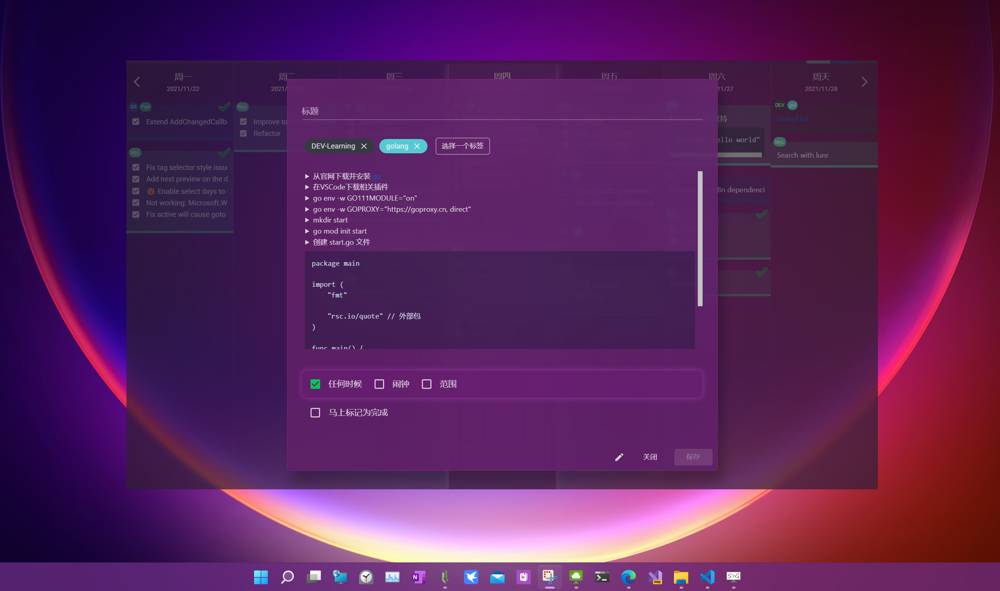

# MyLogs

It can be used as your personal jurnal, learning notes, simple todo app etc.




The core idea is that it is just a bunch of text file with simple format to record every log you write. You can even write with any text editor. So you do not need to be afraid that your data is not readable after many many years when the app is not usable or even operating system is not compatible.

Data is arranged in a file by day like below:

```txt
# [MyLogs]
- Tags: MyLogs,Demo
- Schedule: 17:18:27
- Created: 11/24/2021 16:23:19 +08:00
- Updated: 11/24/2021 17:18:31 +08:00
## Detail
Drag drop reorder
```


## Share with different devices

Currently you can set the local folder to the location of your cloud drive. For example you can set the folder to C:\Users\\(your_name)\OneDrive\MyLogs


## Project detail

1. MyLogs: is the core project which is based on [Fun.Blazor](https://github.com/slaveOftime/Fun.Blazor)
2. MyLogs.MAUI: is the MAUI project which is indend to be used to port to Mac, IOS, Android
3. MyLogs.WPF: is just for Windows. Because currently we cannot make a transparent window with WinUI3 in MAUI.
4. MyLogs.WPF.Package: is for package MyLogs.WPF to Windows store
